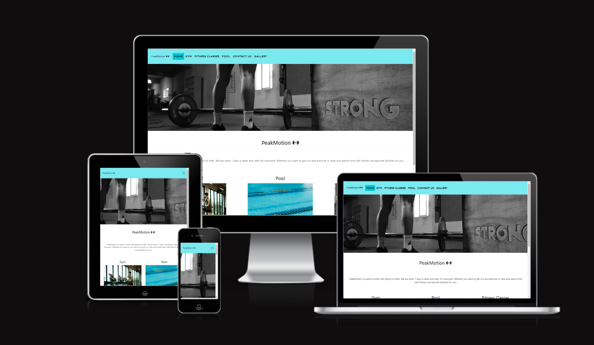
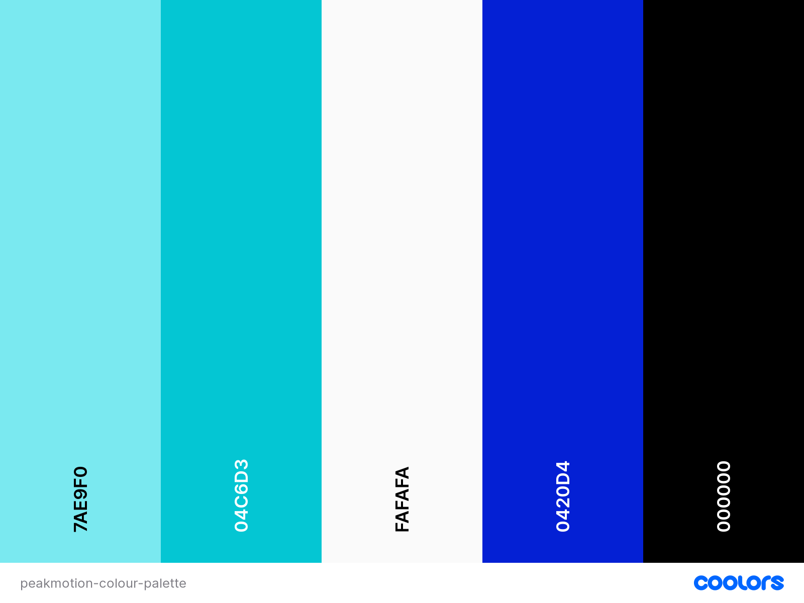
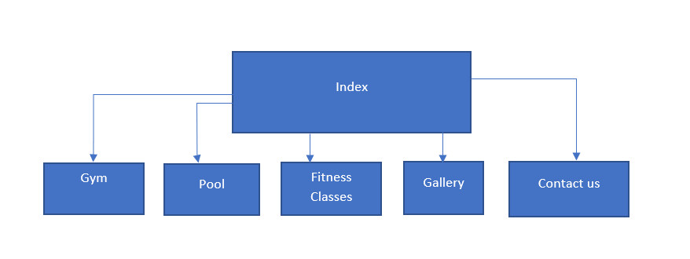
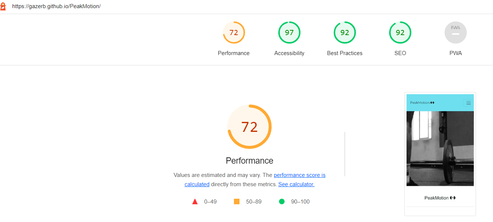

# PeakMotion

## Code institute / City of Bristol College Milestone Project 1



<sub>*Created using* [Am I Responsive](http://ami.responsivedesign.is/)</sub>

PeakMotion is a fake gym. This is my first milestone project for the full stack development course at Code Institute / City of Bristol College. For this project I had to create a static and responsive wesite that had a minimum of three pages using HTML 5 and CSS.

Click <a href="https://gazerb.github.io/PeakMotion/">here</a> to view the live website.

## User Experince 
In this section, I will be providing information on the UX process. Focusing on who the PeakMotion website is for, the main aims of this project and how the website helps to meet the users needs

The Project Goals:
<ul>
    <li>To provide users with information on the facilities at the sports center</li>
    <li>To encourage users to visit and use the sports center</li>
    <li>Help those who wish to contact PeakMotion</li>
    <li>Provide users with information on facilities available, location of the sports center and opening hours</li>
    <li>To create an appealing website that is fully responsive on all devices</li>
</ul>

## User stories

A new gym user:
<ul>
    <li>I need to find out the location of the sports center</li>
    <li>I need to know the opening times of the sports center</li>
    <li>I need to know what facilities are available</li>
</ul>

If i decide to use the sports center i need to:
<ul>
    <li>Be able to contact the sports center</li>
    <li>Be able to find out the costs of each facilities</li>
</ul>

Returning user:

Current user:
<ul>
    <li>I want to be able to view opening hours</li>
    <li>I want to be able to contact the gym and make an equiry</li>
</ul>

Former User:
<ul>
    <li>View opening times</li>
    <li>See what facilities are on offer</li>
    <li>Contact the sports center and make and equiry</li>
</ul>


Buisness Owner:
<ul>
    <li>To encourage more people to use the facilities</li>
    <li>Clearly display information about the sports center</li>
    <li>Visitors to the site are able to contact the buisness</li>
    <li>Encourage visitors to follow our social pages</li>
</ul>


## User Centered Design
### 1. Strategy Plane
The User Centered Design process started with the creation fo the user stories and these influenced the design and layout of the product.


### 2. Scope Plane
<ul>
    <li>Find out information about the sports center's</li>
    <ul>
        <li>Location</li>
        <li>Opening times</li>
        <li>Facilities</li>
    </ul>
    <li>Contact the sports center with a question</li>
    <li>Visit the sports center social media pages</li>
</ul>


### 3. Structure Plane
After idenifying the needs of the users and visiting other local sports center websites the below features were chosen for the website:
<ul>
    <li>Table showing opening times</li>
    <li>Sports center address</li>
    <li>Sports center contact number</li>
    <li>Contact us form</li>
    <li>Hero image for home page</li>
    <li>Gym Logo</li>
    <li>Gym facility page</li>
    <li>Pool facility page</li>
    <li>Fitness classes page</li>
</ul>


### 4. Skeleton Page
To create the wireframes for the product I used <a href="https://www.figma.com/>">Figma</a>. They were created to appear as they would on a desktop, table and mobile.

We have a header containing the logo and nav bar.

To help the website with responsiveness of devices it was decided that when viewed on a tablet or mobile that the nav bar would be in a drop down hamberger menu.

A footer is also included which contains the opening hours, address, contact number and socail media links.

#### Wireframes

Desktop:
<ul>
    <li><a href="documentation/wireframe/Desktop-Home-Page.png">Home Page</a></li>
    <li><a href="documentation/wireframe/Desktop-Gym-Facilities.png">Gym Page</a></li>
    <li><a href="documentation/wireframe/Desktop-Pool-Facilities.png">Pool Page</a></li>
    <li><a href="documentation/wireframe/Desktop-Fitness-classes-Page.png">Fitness classes Page</a></li>
    <li><a href="documentation/wireframe/Desktop-Gallery.png">Gallery page</a></li>
    <li><a href="documentation/wireframe/Desktop-Contact-Us-Page.png">Contact Us Page</a></li>
</ul>


Tablet:
<ul>
    <li><a href="documentation/wireframe/Tablet-Home-Page.png">Home Page</a></li>
    <li><a href="documentation/wireframe/Tablet-Gym-Facilities.png">Gym Page</a></li>
    <li><a href="documentation/wireframe/Tablet-Pool-Facilities.png">Pool Page</a></li>
    <li><a href="documentation/wireframe/Tablet-fitness-classes.png">Fitness Classes Page</a></li>
    <li><a href="documentation/wireframe/Tablet-Gallery-Page.png">Gallery Page</a></li>
    <li><a href="documentation/wireframe/Tablet-Contact-Us.png">Contact Us Page</a></li>
</ul>


Mobile:
<ul>
    <li><a href="documentation/wireframe/Phone-Home-Page.png">Home Page</a></li>
    <li><a href="documentation/wireframe/Phone-Gym-Facilities.png">Gym Page</a></li>
    <li><a href="documentation/wireframe/Phone-Pool-Facilities.png">Pool Page</a></li>
    <li><a href="documentation/wireframe/Phone-Fitness-Classes.png">Fitness Classes Page</a></li>
    <li><a href="documentation/wireframe/Phone-Gallery.png">Gallery Page</a></li>
    <li><a href="documentation/wireframe/Phone-Contact-Us.png">HoContact Us Page</a></li>
</ul>


### 5. Surface Plane
#### Design
Due to the modern society of users now looking for information on mobile phones and tablet this was created with a mobile-first approach.

#### Colour Scheme
The colour scheme was chosen to be simple, clean, bright and visually appealing. Blue is thr traditional colour associated with sports centers with swimming pools so this was chosen along eith white as this is a clean color. Black was chosen for the text and related icons


<sub>*Colour palette created at* [coolors.co](https://coolors.co/7ae9f0-04c6d3-fafafa-0420d4-000000).</sub>

<ul>
    <li>#7AE9F0 / Electric Blue. A nice bright color chosen for the navigation bar</li>
    <li>#04D6C3 / Dark Turquoise. A darker shade of blue chosen for the footer. It was also chosen to highlight the active page the user is on</li>
    <li>#0420D4 / Medum Blue. Chosen for the social icons in the footer to make them stand out. It is also the colour that shows when you hover over a page in the navigation bar</li>
</ul>

#### Icons
Icons were used alongside teat to help the user understand sections of the website at a glance. I have taken the icons used in this project from Font Awesome (https://fontawesome.com/).

#### Typography
After some research, I found that the 4th most common font used on gym and sports websites is Monserrat. I decided to go with the 4th most used as i wanted this website to be similar but also slightly different, This font was used for the logo and navigation bar. Google fonts recommended Roberto as a secondary font so this was used for the body of the website.


## Development
During a mentor session it was advised to me that when in tablet mode I should have a drop down hamberger menu similar to when in mobile mode. This will help the website with responsiveness and look more professional. 

I was also advised during the same session to change the layout to only show two images per row. This would mean the the responsiveness of the website would be better and the images would not appear stretched or pixelated.


### Site Map



## Features
### Consistent features on all pages
<ul>
    <li>Title, displaying on the webpages tab is the title of the website</li>
    <li>Header, contains the same company logo and navigation bar</li>
    <li>Footer, Contains company address, contact number, email, opening times and social links</li>
</ul>

### Features per page
Index:
<ul>
    <li>Hero Image - to improve the look of the website</li>
    <li>Images of the gym, pool and fitness classes with links to relevant pages</li>
</ul>

Gym.html:
<ul>
    <li>Images of the gym facility</li>
</ul>

Pool.html:
<ul>
    <li>Images of the pool facility</li>
</ul>

Fitness-classes.html:
<ul>
    <li>Images of different taking place in our facility</li>
</ul>

Gallery.html:
<ul>
    <li>3 sections containing images of the gym, pool and fitness classes</li>
    <li>Video of a fitness class taking place</li>
</ul>

Contact-us.html:
<ul>
    <li>Full screen contact form to get in touch with any quieries.</li>
</ul>


## Future Features
<ul>
    <li>Online membership sign up with payment option</li>
    <li>Online class timetable</li>
    <li>To be able to book a class online through membership</li>
    <li>Online facility reviews</li>
</ul>


## Technologies used
The below languages were used in this project:
<ul>
    <li>HTML</li>
    <li>CSS</li>
    <li>JavaScript - Imported from Bootstrap and used for the hamberger menu</li>
</ul>

## websites used
<ul>
    <li>Am I Responsive (http://ami.responsivedesign.is/). This was used to create the mock up image at the top of this readme document</li>
    <li>Bootstrap (https://getbootstrap.com/). Used for website layout, responsiveness and hamberger menu</li>
    <li>Code Institute (https://codeinstitute.net/). Modules and walk-through projects have been used and copied in this project</li>
    <li>Coolors (https://coolors.co/7ae9f0-04c6d3-fafafa-0420d4-000000). Used to create website colour scheme and palette</li>
    <li>Font Awesome (https://fontawesome.com/). Used for icons within website</li>
    <li>Chrome Developer tools. Used to test website for buys and responsiveness</li>
    <li>Google Fonts. Used to incorporate fonts in website</li>
    <li>Github. Used for site respository and to deplay website</li>
    <li>Gitpod. Online developer tool used to build and develop this project</li>
    <li>Pexels.com. Used to collect images for this project</li>
    <li>W3C CSS Validation. Used to validate projects CSS code</li>
    <li>W3C HTML Validation. Used ti validate projects html pages / code</li>
    <li>Figma. Used to create websites wireframes</li>
</ul>

## Performance Testing
### Lighthouse testing
I used the chrome extension 'Lighthouse' to test the performance of the website. Below is the capture of my first report which came back with a performance of 72 and to re size the images would improve performance which was what i then went on to do.



After changing the images the new light house report showed an increase to 78.


### W3C HTML Validator


## Gitpod Reminders

To run a frontend (HTML, CSS, Javascript only) application in Gitpod, in the terminal, type:

`python3 -m http.server`

A blue button should appear to click: _Make Public_,

Another blue button should appear to click: _Open Browser_.

To run a backend Python file, type `python3 app.py`, if your Python file is named `app.py` of course.

A blue button should appear to click: _Make Public_,

Another blue button should appear to click: _Open Browser_.

In Gitpod you have superuser security privileges by default. Therefore you do not need to use the `sudo` (superuser do) command in the bash terminal in any of the lessons.

To log into the Heroku toolbelt CLI:

1. Log in to your Heroku account and go to *Account Settings* in the menu under your avatar.
2. Scroll down to the *API Key* and click *Reveal*
3. Copy the key
4. In Gitpod, from the terminal, run `heroku_config`
5. Paste in your API key when asked

You can now use the `heroku` CLI program - try running `heroku apps` to confirm it works. This API key is unique and private to you so do not share it. If you accidentally make it public then you can create a new one with _Regenerate API Key_.

------

## Release History

We continually tweak and adjust this template to help give you the best experience. Here is the version history:

**September 1 2021:** Remove `PGHOSTADDR` environment variable.

**July 19 2021:** Remove `font_fix` script now that the terminal font issue is fixed.

**July 2 2021:** Remove extensions that are not available in Open VSX.

**June 30 2021:** Combined the P4 and P5 templates into one file, added the uptime script. See the FAQ at the end of this file.

**June 10 2021:** Added: `font_fix` script and alias to fix the Terminal font issue

**May 10 2021:** Added `heroku_config` script to allow Heroku API key to be stored as an environment variable.

**April 7 2021:** Upgraded the template for VS Code instead of Theia.

**October 21 2020:** Versions of the HTMLHint, Prettier, Bootstrap4 CDN and Auto Close extensions updated. The Python extension needs to stay the same version for now.

**October 08 2020:** Additional large Gitpod files (`core.mongo*` and `core.python*`) are now hidden in the Explorer, and have been added to the `.gitignore` by default.

**September 22 2020:** Gitpod occasionally creates large `core.Microsoft` files. These are now hidden in the Explorer. A `.gitignore` file has been created to make sure these files will not be committed, along with other common files.

**April 16 2020:** The template now automatically installs MySQL instead of relying on the Gitpod MySQL image. The message about a Python linter not being installed has been dealt with, and the set-up files are now hidden in the Gitpod file explorer.

**April 13 2020:** Added the _Prettier_ code beautifier extension instead of the code formatter built-in to Gitpod.

**February 2020:** The initialisation files now _do not_ auto-delete. They will remain in your project. You can safely ignore them. They just make sure that your workspace is configured correctly each time you open it. It will also prevent the Gitpod configuration popup from appearing.

**December 2019:** Added Eventyret's Bootstrap 4 extension. Type `!bscdn` in a HTML file to add the Bootstrap boilerplate. Check out the <a href="https://github.com/Eventyret/vscode-bcdn" target="_blank">README.md file at the official repo</a> for more options.

------

## FAQ about the uptime script

**Why have you added this script?**

It will help us to calculate how many running workspaces there are at any one time, which greatly helps us with cost and capacity planning. It will help us decide on the future direction of our cloud-based IDE strategy.

**How will this affect me?**

For everyday usage of Gitpod, it doesn’t have any effect at all. The script only captures the following data:

- An ID that is randomly generated each time the workspace is started.
- The current date and time
- The workspace status of “started” or “running”, which is sent every 5 minutes.

It is not possible for us or anyone else to trace the random ID back to an individual, and no personal data is being captured. It will not slow down the workspace or affect your work.

**So….?**

We want to tell you this so that we are being completely transparent about the data we collect and what we do with it.

**Can I opt out?**

Yes, you can. Since no personally identifiable information is being captured, we'd appreciate it if you let the script run; however if you are unhappy with the idea, simply run the following commands from the terminal window after creating the workspace, and this will remove the uptime script:

```
pkill uptime.sh
rm .vscode/uptime.sh
```

**Anything more?**

Yes! We'd strongly encourage you to look at the source code of the `uptime.sh` file so that you know what it's doing. As future software developers, it will be great practice to see how these shell scripts work.

---

Happy coding!
